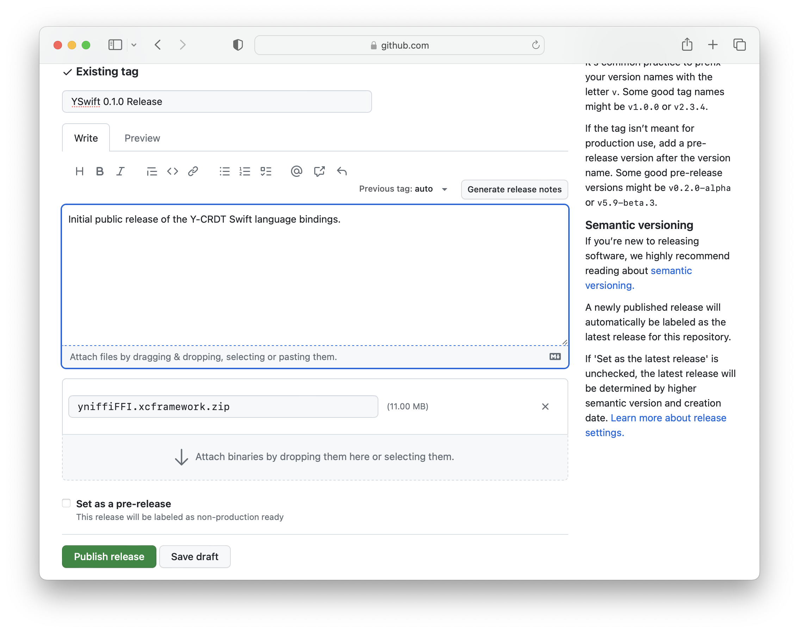

# GitHub oriented Swift package release process

Release process:

Check out the latest code, or at the mark you want to release.
While the CI system is pretty solid, it's worthwhile to do a fresh repository clone, run a full build, and all the relevant tests before proceeding.

The process will be tagging, but not until we've made a commit that explicitly sets up the downloadable packages from GitHub release artifacts.

Steps:

- run `./scripts/build-xcframework.sh` to build the XCFramework and regenerate all the relevant C/FFI library components.
- Capture the build hash (sha256) of the XCFramework that the script prints out at the end of it's process.
It will look something like:

```
SHA256(yniffiFFI.xcframework.zip)= 9aa2dd069662613b66749a257d753fc7007afe4817278edfd6cc902de94b5f6c
```

- switch the binary target in Package.swift for yniffiFFI to a url and checksum reference. The url references the download path for release artifacts from a tag.
The pattern is roughly:

```
https://github.com/heckj/yswift/releases/download/0.1.0/yniffiFFI.xcframework.zip
```

- Set the checksum to the one you just captured for the build of the XCFramework.
- comment out the globalSwiftSettings that sets unsafe build flags - Xcode gets freaked out and won't use a release with this enabled.

(Note: at this stage, a local build will not work - as we haven't created the release yet on GitHub with its artifacts)

- commit the changes to Package.swift and push those changes to GitHub.
- tag the release locally after the commit, to set a point that we can build a release from.
  Set the tag to a semantic version that Package.swift supports.
(Note: GitHub suggests tags like `v0.1.0`, but Swift packages have a rough time with the preceeding `v` in the semantic coding, so I recommend using a bare tag, and suffixing if `-beta` or such if you're making a beta release.)

```
git tag 0.1.0
git push origin --tags
```

- open a browser and navigate to the URL that you can use to create a release on GitHub.
  - https://github.com/y-crdt/yswift/releases/new
  - choose the existing tag (`0.1.0` in this example)


  - add a release title
  - add in a description for the release
  - drag the file `yniffiFFI.xcframework.zip` from the `lib` directory onto the github page to attach the binary.
  - wait for the upload to complete and verify the file is listed.
  - select the checkout for a pre-release if relevant.



(NOTE: the title and description details can be editing later without impact, but it is critically important to get the binary with the tag set as you expect - and that isn't editable if you miss it.)

- click `Publish release`


